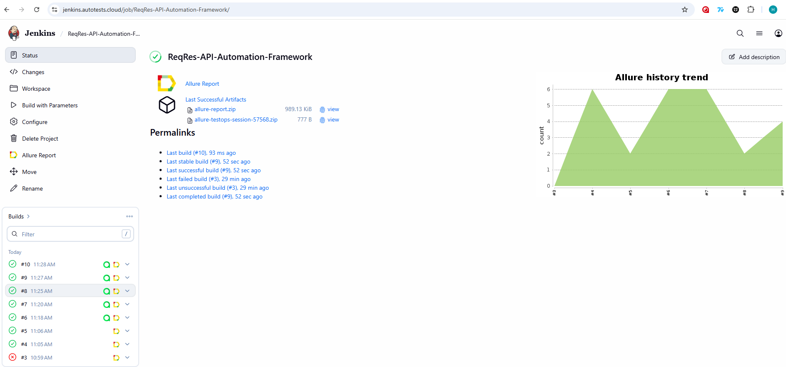
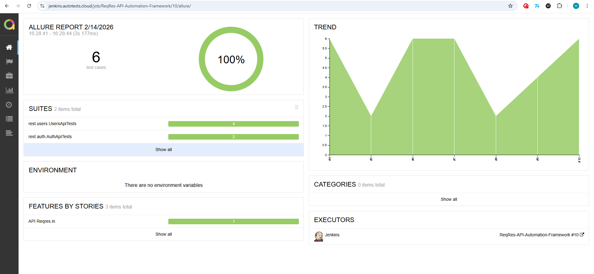
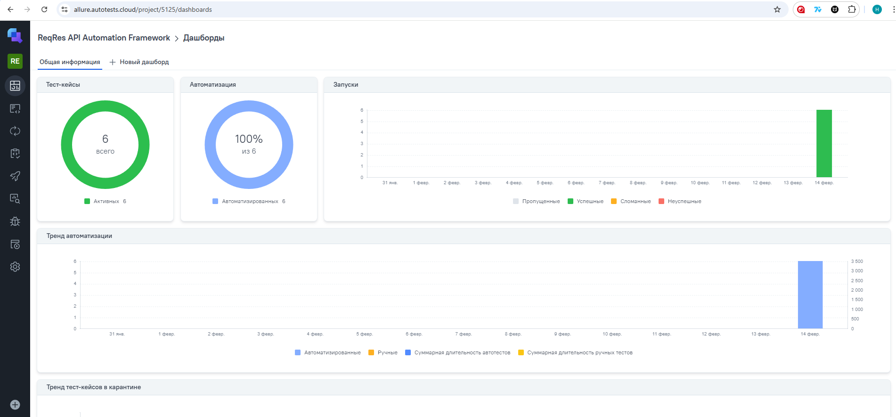
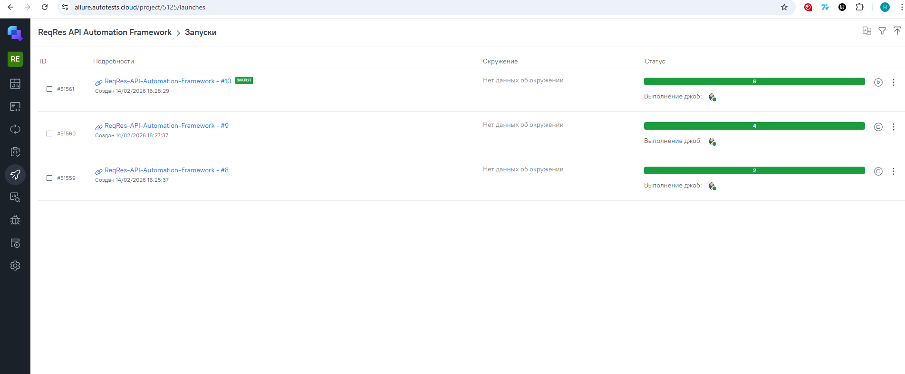
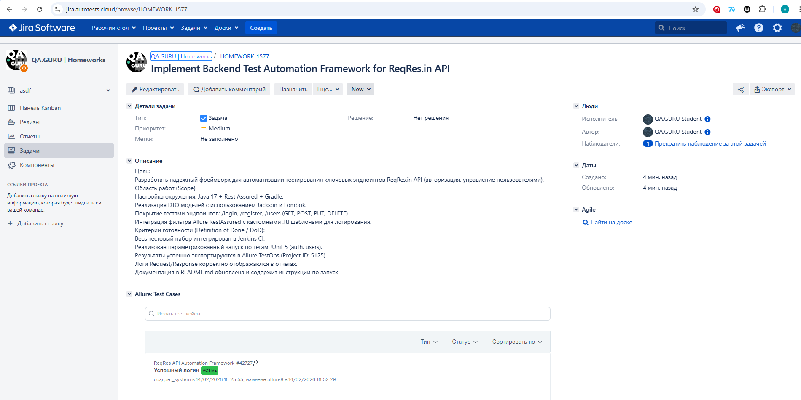
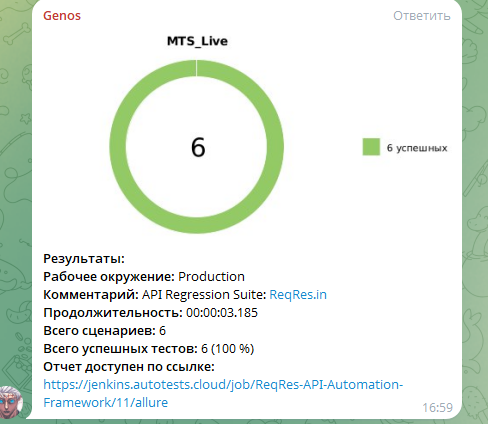

# 🎓 Дипломный проект  
# Фреймворк автоматизированного тестирования REST API сервиса **Reqres.in**

<p align="center">
  
</p>

**Reqres.in** — это демонстрационный REST API сервис, используемый для тестирования и отработки навыков API-автоматизации.

---

## 📌 Описание проекта

Данный проект разработан в рамках дипломной работы и представляет собой **фреймворк автоматизированного тестирования REST API**.

В качестве тестовой платформы выбран сервис **Reqres.in**, что позволило продемонстрировать архитектурный подход к построению API-автотестов без ограничений, связанных с защищёнными production-сервисами.

Проект демонстрирует:

- 🔌 автоматизацию REST API с использованием RestAssured  
- 🧱 построение чистой layered-архитектуры  
- 📦 работу с DTO и сериализацией JSON  
- 📊 интеграцию с Allure Report  
- ⚙ интеграцию с CI/CD (Jenkins)  

---

## 🎯 Цель и задачи проекта

### Цель  
Разработка масштабируемого и поддерживаемого фреймворка для автоматизации тестирования REST API.

### Задачи

- Реализовать API-автотесты с использованием DTO-моделей  
- Настроить централизованные Request/Response спецификации  
- Реализовать кастомную интеграцию Allure с шаблонами Request/Response  
- Настроить выборочный запуск тестов через JUnit 5 Tags  
- Организовать параметризованный запуск через Jenkins  
- Обеспечить чистую архитектуру и расширяемость проекта


---

## 🛠 Технологический стек

<p align="center">


 
</p>

---


# 🔌 API АВТОТЕСТЫ

API-тесты покрывают ключевые сценарии работы REST сервиса **Reqres.in**.  
Все тесты реализованы с использованием **RestAssured + JUnit 5** и построены на основе централизованных спецификаций и DTO-моделей.

---

## 🧪 Реализованные сценарии

### 👤 Users (CRUD)

- **GET: Получение списка пользователей**  
  Проверка корректности данных и email пользователя.

- **POST: Создание пользователя**  
  Проверка успешного создания и корректности возвращаемых данных.

- **PUT: Обновление пользователя**  
  Проверка обновления полей и статуса ответа.

- **DELETE: Удаление пользователя**  
  Проверка корректного статус-кода (204).

---

### 🔐 Auth

- **Успешный логин**  
  Проверка получения токена при валидных данных.

- **Негативный сценарий (без пароля)**  
  Проверка корректного сообщения об ошибке и статус-кода 400.

---

## 🏗 Архитектура API-тестов

API-тесты построены с использованием Layered Architecture:

- ✔ Все тесты наследуются от `ApiTestBase` (настройка baseURI и basePath)  
- ✔ Централизованные спецификации в `ReqresSpecs`  
- ✔ DTO-модели для сериализации и десериализации (Jackson + Lombok)  
- ✔ Используются JUnit 5 Tags (`@Tag("auth")`, `@Tag("users")`)  
- ✔ Шаги логируются через `step()` (Allure)  
- ✔ Подключён кастомный `CustomApiListener` с `.ftl` шаблонами  
- ✔ Логирование Request/Response добавляется в Allure отчет  


# ⚙️ CI/CD и ИНТЕГРАЦИИ

## 🛠 Jenkins

[Ссылка на сборку в Jenkins](https://jenkins.autotests.cloud/job/ReqRes-API-Automation-Framework/)

Для запуска сборки необходимо перейти в раздел <code>Собрать с параметрами</code>, выбрать значение для таких параметров как: COMMENT, TEST_TAG. Далее нажать кнопку <code>Собрать</code>.
<p align="center">

</p>
После выполнения сборки, в блоке <code>История сборок</code> напротив номера сборки появятся значки <code>Allure Report</code> и <code>Allure TestOps</code>, при клике на которые откроется страница с сформированным html-отчетом и тестовой документацией соответственно.

---

## 📊 Allure Report

[Ссылка на Allure отчёт](https://jenkins.autotests.cloud/job/mts-live-automation-framework/19/allure/)



---

## 🧪 Allure TestOps

[Ссылка на проект в Allure TestOps](https://allure.autotests.cloud/project/5125/dashboards)

На *Dashboard* в <code>Allure TestOps</code> видна статистика по тестам: автоматизированных тестов, результаты прогона при каждом запуске сборки.



## Результат выполнения автотестов


---

## 🐞 Интеграция с Jira

[Ссылка на задачу в Jira](https://jira.autotests.cloud/browse/HOMEWORK-1577)



Тест-кейсы связаны с задачами, результаты прогонов отображаются в задачах.

---

## 📩 Уведомления в Telegram



После завершения сборки бот отправляет уведомление с результатами тестирования.

---

# ▶️ Запуск тестов

## 💻 Локальный запуск

### ▶ Запуск всех тестов
```bash
./gradlew clean test
```

### ▶🔐 Запуск только Auth тестов
```bash
./gradlew clean test -Dgroups=auth
```
### ▶👤 Запуск только Users тестов
```bash
./gradlew clean test -Dgroups=users
```
# ⚙️ Запуск через Jenkins

В Jenkins настроен параметризованный запуск.

### Шаг 1. Собрать с параметрами
Перед запуском тестов необходимо нажать кнопку **Собрать с параметрами (Build with Parameters)** в интерфейсе Jenkins.

### Шаг 2. Выбор параметра

**TEST_TAG** — выбор группы тестов для прогона. Возможные значения:

- `auth` — запуск тестов авторизации  
- `users` — запуск CRUD тестов пользователей  
- `all` — запуск всех тестов  

### Шаг 3. Запуск
После выбора нужного значения нажмите кнопку **Build**.  
Jenkins выполнит сборку и прогон выбранной группы тестов.


# 🔐 Безопасность

В проекте используется API-ключ, передаваемый в header: **x-api-key**
В текущей версии ключ указан напрямую в коде, так как сервис **Reqres.in** является тренировочной платформой и не содержит реальных конфиденциальных данных.

---

## 🔒 Как это реализуется в реальном проекте

В production-проекте:

- API-ключ не хранится в репозитории  
- Передаётся через системные переменные  
- Хранится в Jenkins Credentials или Secret Manager  


